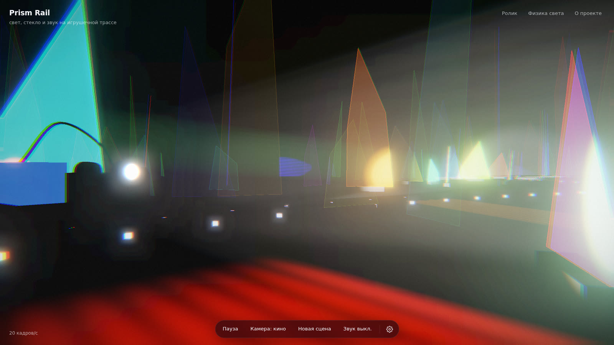

# Prism Rail

**English** · [Русский](README.ru.md)

**Demo: [nemilya.me/projects/prism-rail](https://nemilya.me/projects/prism-rail/)**

A 3D light-installation simulator in the browser. A toy cart with two side spotlights rolls along a closed
track in a dark room among hundreds of dichroic glass panes. The light bounces off and passes through the glass,
painting colored spots across the room, and generative music follows the light: every pane in the beam plays its own note.



## The site

The site is bilingual: English is the primary language (at the root), Russian lives in `ru/`. The EN · RU switch is
at the top right; a Russian-speaking visitor arriving at the main page is sent to `ru/` automatically (browser
language or time zone, as in `nemilya/scantunnel`), and an explicit choice is remembered.

| path | what's there |
|---|---|
| `/`, `ru/` | the simulator: the “Watch with sound” splash starts the scene and the music with one click |
| `/#clover.300.spectrum.40.10.lumen-482` | a specific scene: the code is track shape, pane count, palette, pull, size, seed |
| `about/`, `ru/about/` | “About”: the video, the physics, simulator stills, inspiration |
| `about/#video` | the video “A rainbow in the dark” with chapters and subtitles |
| `about/#physics` | the physics of light: refraction, dispersion, rainbows, dichroic glass |
| `video/?film=refraction&lang=en` | the same video in the live player: the simulator draws the frames right in the browser |

At the bottom of the simulator are the scene controls (pause, camera, new scene, sound) and a gear with
scene, light and sound settings. At the top right are the site sections and the language. Keys: Space — pause,
C — camera, R — new scene, M — music, H — hide the interface, 1–5 — presets.

Desktop only: WebGL and sound are required.

## The video

“A rainbow in the dark” (`video/films/refraction/`) — in English and Russian. **This is a test video: a demo of
how well Claude Opus can visualize and explain physics. It has not been reviewed and is provided as is** — the
video itself and the “About” page say so too.

## Inspiration

The project is inspired by **DEVIATION**, an installation by Studio Sven Sauer —
[Instagram post](https://www.instagram.com/p/DOdgUZWDD6o/?img_index=1).

## Layout

| path | what it is |
|---|---|
| `sim/index.html` | the simulator in one file (Three.js r128 + Tone.js 14.8 from a CDN); the UI is in English, Russian is the `RU` dictionary in the same file; `?embed` is the capture mode for videos |
| `site/` | the site per language: `site.mjs` (URL, languages), `i18n/en.mjs`, `i18n/ru.mjs` (texts), `about.html` (the “About” template), `lang.js` (language auto-pick) |
| `about/` | images, styles and script of the “About” page |
| `index.html` | in the repo — a redirect to `sim/` (the scene code is kept); on the site the simulator itself takes its place |
| `video/` | videos: scenes, chalk drawings, dialogue voice-over, MP4 rendering — see [`video/README.md`](video/README.md) (in Russian) |
| `tools/site.mjs`, `tools/dist.mjs` | per-language pages and the site build into `dist/` |
| `docs/i18n.md` | where the translations live and how to add a language (in Russian) |
| `docs/spec.md` | the original spec (in Russian) |

## Commands

Requires Node 22 and `ffmpeg`. Run everything from the root; `make help` lists all targets.

```bash
make install                     # Playwright, Chromium, local three.js and Tone.js (once)
make play                        # locally: the site (en and ru/), “About”, the video player — http://127.0.0.1:8790/
make test                        # texts, scenes, sounds, determinism, simulator API, site pages and translation

make voice FILM=refraction LANGS=en   # voice-over (needs OPENROUTER_API_KEY; synthesis is paid)
make video FILM=refraction LANGS=en   # MP4 with sound → out/refraction/
make web FILM=refraction LANGS=en     # a light version for the site → out/refraction/web/

make dist                        # the finished site → dist/
make preview                     # build dist/ and open it: http://127.0.0.1:8791/
make deploy                      # build and upload with rsync to DEPLOY
```

`out/` and `dist/` are build output and are not in git.

## Deploying

`make dist` puts everything the browser needs into `dist/`: the simulator and “About” in English at the root and
in Russian in `ru/`, `sim/` for old links, web versions of the video in `media/` (from `out/refraction/web/`, one
per language), the live player `video/`, `lang.js` and `sitemap.xml`. Copy the contents of `dist/` to the host
as is. If the web version of the video is missing for a language, “About” in that language shows the live player.

All links are relative, so the site also works from a subfolder such as `/projects/prism-rail/` (with a trailing
slash). The URL for canonical, hreflang and `sitemap.xml` is `url` in `site/site.mjs`.
For `make deploy`, set the path in `local.mk`:

```make
DEPLOY = user@host:/path/projects/prism-rail/
```
