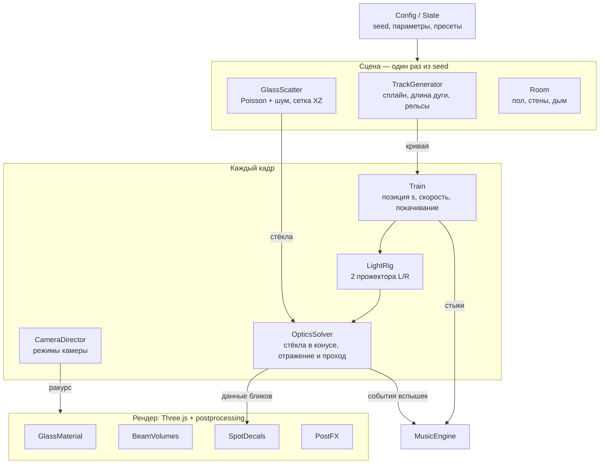

# Prism Rail — постановка задачи на симулятор

4 октября 2026

## Концепция

Собираем браузерный 3D-симулятор световой инсталляции: в тёмной комнате по замкнутой трассе едет игрушечная тележка с двумя прожекторами, бьющими влево и вправо, а вокруг в случайном порядке стоят дихроичные стёкла. Свет проходит сквозь стёкла и отражается от них, и по полу, стенам и соседним стёклам бегут цветные блики, которые постоянно меняются вместе с движением тележки.

Цель — зрелищная, почти медитативная сцена, которую можно смотреть как видео, и одновременно песочница: пользователь меняет трассу, плотность стёкол, свет и камеру и сразу видит результат.

- **Ощущение:** «кристальный город ночью, через который проезжает фонарь». Темнота — главный материал, свет появляется только там, где проехала тележка.
- **Масштаб:** игрушечный, 1 единица = 1 м. Колея 45 мм (G-масштаб), тележка длиной около 12 см, стёкла высотой от 8 до 60 см.
- **Платформа:** браузер, только десктоп (последние версии Chrome, Firefox, Safari, Edge); мобильная версия не планируется.
- **Реализм:** правдоподобный, а не физически точный. Честную трассировку света заменяем дешёвыми приёмами, которые выглядят так же (см. «Оптика»).

## Сцена

Сцена генерируется процедурно из одного seed: одинаковый seed и параметры всегда дают одну и ту же комнату, трассу и расстановку стёкол.

### Помещение

- Комната 8 × 6 м, высота 3 м (настраивается). Пол чёрный, матовый с лёгким глянцем (roughness ≈ 0.55), чтобы в нём слабо отражались блики. Стены и потолок тёмно-серые, roughness ≈ 0.9.
- Внешнего света нет. Ambient ≈ 0.02, только чтобы силуэты не проваливались в абсолютный ноль.
- Опционально лёгкая дымка в воздухе (параметр «Дым», 0–1): без неё лучи невидимы, видны только пятна.

### Трасса

Трасса — замкнутый сплайн Catmull-Rom, по которому строятся рельсы и движется тележка. Вручную трасса не редактируется: пользователь выбирает только форму и seed.

1. **Овал** — базовый вариант для MVP.
2. **Клевер / змейка** — несколько петель, как в референсе.
3. **Восьмёрка** — с пересечением на одном уровне.
4. **Процедурная** — 6–12 случайных контрольных точек внутри комнаты с проверками: минимальный радиус поворота 0.35 м, нет самопересечений (кроме режима «восьмёрка»), отступ от стен не меньше 0.4 м. Если проверка не проходит — повторная генерация, до 50 попыток.

Рельсы: две нитки (профиль 4 × 5 мм) плюс шпалы с шагом 30 мм, всё через instancing. Длина трассы 12–25 м.

### Стёкла

- **Количество:** 150–400 (по умолчанию 250).
- **Форма:** «осколок» — случайный выпуклый многоугольник из 3–5 вершин, вытянутый вверх, с острой верхушкой. Высота 0.08–0.6 м, ширина 0.03–0.25 м, толщина 3 мм.
- **Установка:** стоят вертикально в чёрной подставке-бруске, наклон ±5°, поворот вокруг вертикали случайный.
- **Расстановка:** Poisson disk sampling, минимальное расстояние между стёклами 6–10 см. Коридор вокруг трассы (габарит тележки + 3 см) запрещён. Плотность растёт к трассе по закону exp(−d / σ), σ ≈ 0.4 м, чтобы лучи чаще цеплялись за стёкла. Поверх накладывается шум (Simplex), который собирает стёкла в «рощи» и оставляет пустые поляны.
- **Индивидуальность:** у каждого стекла свой оттенок плёнки (центральная длина волны λ₀ из палитры) — это главный источник разнообразия цветов.

## Тележка и лучи

Едет одна тележка с двумя боковыми прожекторами; поезда из нескольких вагонов не будет.

### Модель

Платформа 120 × 70 × 50 мм, четыре колеса, на ней блок с двумя прожекторами по бокам. Тёмный пластик и мелкие детали (провода, батарейный блок с синей подсветкой) — для узнаваемости по референсу.

### Движение

- Позиция задаётся параметром s — расстоянием вдоль трассы. Сплайн заранее параметризуется по длине дуги (таблица из ~2000 отсчётов), чтобы скорость была равномерной на поворотах.
- Скорость 0.1–0.6 м/с, по умолчанию 0.25. Плавный разгон и торможение при смене скорости или паузе.
- Ориентация — по касательной к кривой. Микропокачивание (амплитуда ~0.5 мм, частота привязана к стыкам рельсов) делает свет живым: блики слегка дрожат, как на видео.
- Опционально: остановки на 2–4 с в случайных местах, чтобы рассмотреть картину.

### Прожекторы

Каждый прожектор одновременно освещает сцену, рисует видимый конус в дымке и служит источником для расчёта бликов.

| Параметр | Диапазон | По умолчанию |
| --- | --- | --- |
| Направление | перпендикулярно ходу, влево и вправо | ±90° |
| Поворот вперёд/назад (yaw) | −30…+30° | 0° |
| Наклон (pitch) | −10…+10° | −2° |
| Угол конуса | 6–25° | 10° |
| Мягкость края (penumbra) | 0–1 | 0.3 |
| Цветовая температура | 3000–9000 K | 6500 K |
| Дальность | 2–10 м | 6 м |
| Сканирование | выкл. / медленное качание по yaw | выкл. |

Опционально третий прожектор вперёд по ходу — как на первом кадре референса.

## Оптика и визуал

Зрелищность держится на четырёх слоях: переливающиеся стёкла, цветные пятна-блики на поверхностях, видимые лучи в дымке и постобработка. Всё считается упрощённо, без настоящей трассировки.

### Дихроичное стекло

Дихроичная плёнка отражает одну часть спектра и пропускает дополняющую, а пик смещается в синюю сторону с ростом угла падения θ. Для шейдера и для расчёта бликов используем одну модель:

```math
\lambda_{peak}(\theta) = \lambda_0 \sqrt{1 - \left( \frac{\sin\theta}{n_{eff}} \right)^2}
```

- λ₀ — индивидуальная длина волны стекла (450–650 нм, из палитры), n_eff ≈ 1.6.
- Цвет отражения C_r(θ) = спектральный цвет λ_peak (аппроксимация длины волны в RGB) с гауссовым профилем шириной ~60 нм. Цвет пропускания C_t(θ) = 1 − C_r(θ), нормированный по яркости. Так одно стекло даёт два разных цвета в разные стороны, как в реальности.
- Коэффициент отражения R(θ) = 0.25 + 0.5 · Schlick-френель, остальное проходит.

### Материал стекла (как выглядит само стекло)

- Прозрачность ~0.85, цвет поверхности берётся из той же модели по углу обзора камеры — стекло переливается при облёте.
- Свечение граней (edge glow): торцы стекла светятся цветом C_t, когда стекло в луче. На референсе это самая заметная деталь — острые светящиеся кромки.
- Яркость стекла = сумма вкладов прожекторов, попавших на него в этом кадре (передаётся per-instance атрибутом).

### Блики на поверхностях

Для каждого стекла, попавшего в конус прожектора, на CPU считаются два вторичных луча: отражённый r = d − 2(d·n)n и прошедший (направление d почти без изменений). Каждый луч пересекается аналитически с полом, стенами и потолком, и в точке попадания рисуется пятно.

- **Форма пятна** — проекция многоугольника стекла (маска-текстура), растянутая по углу падения на поверхность. Поэтому пятна получаются острыми «осколками», а не кругами.
- **Цвет и яркость** — C_r · R(θ) для отражения и C_t · (1 − R(θ)) для прохода, умноженные на интенсивность прожектора в точке стекла и затухание по расстоянию.
- **Реализация:** самые яркие K пятен (K = 24 на High) — настоящие проекционные spot-источники, которые освещают и стёкла рядом. Остальные — дешёвые аддитивные декали на полу и стенах.
- **Цепочки:** если прошедший луч упирается в следующее стекло, его цвет умножается на C_t первого. Глубина: 1 отскок на Low/Medium, 2 на High/Ultra.
- **Окклюзия:** стёкла в луче сортируются по расстоянию; каждое следующее получает свет, ослабленный пропусканием предыдущих (цветные «тени»).

### Видимые лучи

- Основной луч прожектора — меш-конус с аддитивным шейдером: затухание по длине, мягкие края по углу к оси, 3D-шум (медленно плывущий дым). Плотность — параметр «Дым».
- Отражённые лучи — такие же тонкие конусы/ленты от стекла до точки попадания, цвет C_r, яркость ниже основного.
- High/Ultra: честный raymarched объёмный свет в отдельном проходе на пониженном разрешении с картой теней прожектора — лучи режутся силуэтами стёкол.

### Постобработка

- Bloom (порог ~0.6, сила ~1.2) — даёт ореолы и «засветку» как на видео с телефона.
- Тонмаппинг ACES, лёгкая хроматическая аберрация по краям, зерно, виньетка.
- Опционально: motion blur и tilt-shift DOF для игрушечного макро-ощущения.

## Камера и режимы просмотра

По умолчанию сцена открывается в кинематографическом режиме, чтобы с первой секунды выглядеть как видео; управление камерой — по клику.

| Режим | Как работает | Зачем |
| --- | --- | --- |
| Кино (по умолчанию) | Автоматический облёт: набор шотов по 8–12 с с плавными переходами — низкий проезд рядом с тележкой, общий план сверху, статичный кадр сквозь стёкла | «Вау» при открытии, режим заставки |
| Орбита | Вращение и зум вокруг точки, точка следует за тележкой или зафиксирована | Рассмотреть сцену |
| На борту | Камера на тележке, смотрит вперёд или вбок вдоль луча | Ракурс как на референсе |
| Погоня | Сзади-сверху, мягкое следование с запаздыванием | Динамичный вид |
| Свободный полёт | WASD + мышь | Исследование |
| Фото | Пауза, ручной фокус DOF, экспорт PNG в 2× / 4× разрешении | Красивые кадры |

- Фокусное расстояние 35–70° FOV. Камера не может опуститься ниже 1 см над полом и пройти сквозь стёкла (мягкое отталкивание).
- Смена режима — плавная интерполяция за ~1 с, без рывков.

## Интерфейс и настройки

Интерфейс минимальный и не спорит со сценой: тонкая полупрозрачная панель справа, сворачивается в иконку, полностью скрывается клавишей H.

### Панель параметров

| Группа | Параметры |
| --- | --- |
| Сцена | seed, форма трассы, размер комнаты, количество стёкол, притяжение к трассе (σ), кластеризация |
| Тележка | скорость, остановки вкл./выкл. |
| Свет | угол конуса, интенсивность, цветовая температура, yaw/pitch, сканирование, передний прожектор, дым |
| Стекло | палитра, разброс λ₀, отражательность, свечение граней |
| Пост | bloom, аберрация, зерно, виньетка, DOF |
| Камера | режим, FOV, автосмена шотов |
| Качество | Low / Medium / High / Ultra, авто |
| Музыка | вкл./выкл., общая громкость, громкость слоёв, лад (авто по палитре / ручной), плотность нот |

### Пресеты

- **Референс** — клевер, 300 стёкол, полный спектр, дым 0.4. Максимально похоже на видео.
- **Ледяной** — холодная палитра (450–520 нм), много дыма, медленная скорость.
- **Закат** — тёплая палитра (560–650 нм), низкий наклон прожекторов, длинные пятна на полу.
- **Минимал** — 60 крупных стёкол, без дыма, только пятна на чёрном полу.
- **Хаос** — 400 стёкол, сканирующие прожекторы, 2 отскока.

### Действия и горячие клавиши

- Кнопки: «Сгенерировать заново», «Случайный пресет», «Пауза», «Снимок», «Поделиться».
- «Поделиться» кодирует seed и все параметры в hash URL — ссылка открывает ту же самую сцену.
- Клавиши: Space — пауза, C — следующая камера, R — новый seed, H — скрыть UI, P — фото-режим, M — музыка вкл./выкл., 1–5 — пресеты.

## Генеративная музыка

Музыка не проигрывается из файлов, а синтезируется в реальном времени из тех же данных, что и свет: каждая вспышка стекла — нота, цвет стекла — её высота, общая освещённость сцены — громкость и «открытость» фона. Тележка остановилась и свет замер — музыка затихает до дрона и хвостов реверберации.

### Слои

1. **Дрон** — постоянный тёплый фон из 2–3 расстроенных осцилляторов с медленным фильтром. Аккорд сменяется раз в 8 тактов (≈ 30–60 с). Громкость и срез фильтра следуют суммарной яркости бликов, сглаженной за 2 с.
2. **Стекло** — главный слой. Когда стекло входит в луч, звучит колокольная нота (FM-синтез, атака ~5 мс, хвост 3–6 с). Отражённый блик, долетевший до стены или другого стекла, даёт тихое эхо октавой выше.
3. **Пульс** — мягкий приглушённый стук колёс на стыках рельсов. Секции трассы по 30 см, поэтому темп задаёт скорость тележки: при 0.25 м/с это ~50 ударов в минуту.
4. **Текстура** — фильтрованный шум, «воздух» комнаты. Громкость равна параметру «Дым», сканирование прожекторов слегка двигает фильтр.

### Связь «свет → звук»

| Источник в сцене | Параметр звука |
| --- | --- |
| Стекло вошло в луч (фронт яркости) | Нота в слое «Стекло» |
| λ₀ стекла (его цвет) | Высота: ступень лада, синие стёкла выше, красные ниже |
| Яркость вспышки | Громкость ноты и яркость тембра (индекс FM) |
| Положение стекла слева/справа от камеры | Панорама в стерео |
| Отражённый блик | Эхо-нота октавой выше, на 9 дБ тише, с задержкой 1/8 |
| Суммарная освещённость сцены | Громкость и фильтр дрона |
| Скорость тележки | Темп пульса и сетки квантования |
| Дым | Громкость текстуры и длина реверберации |
| Палитра стёкол | Лад (см. ниже) |
| Пауза или остановка | Плавное затухание слоёв за 2–4 с |

Обратная связь для цельности: яркость видимых лучей слегка «дышит» вместе с LFO дрона (±5%), а свечение граней стекла чуть вспыхивает в момент атаки его ноты. Зритель воспринимает свет и звук как одно целое.

### Гармония

- **Лад зависит от палитры:** «Полный спектр» и «Референс» — мажорная пентатоника (не может диссонировать); «Ледяной» — лидийский; «Закат» — дорийский; «Минимал» — одна нота и её октавы и квинты; «Хаос» — целотонная гамма.
- **Тоника** выводится из seed детерминированно: одна и та же сцена всегда звучит в одной тональности.
- **Квантование:** ноты не звучат в момент вспышки, а выравниваются по сетке восьмых при текущем темпе, с небольшим очеловечиванием ±15 мс. Плотная «роща» стёкол звучит как арпеджио, а не как каша.
- **Полифония:** не больше 8 одновременных нот стекла; при перегрузке остаются самые яркие.
- **Гистерезис:** нота срабатывает, когда яркость стекла поднимается выше 0.35, и может сработать снова только после падения ниже 0.2. Стекло на краю конуса не будет дребезжать нотами.

### Микс

- Каждый слой → свой gain → общий длинный реверб (6–10 с, «большой тёмный зал») + ping-pong delay только для стекла → лимитер на мастере.
- Браузер не даёт запустить звук без действия пользователя: музыка стартует по первому клику или кнопке «Включить звук» с плавным нарастанием за 3 с.
- Отдельные регуляторы громкости слоёв — в группе «Музыка» панели параметров.

### Реализация

- **Tone.js:** PolySynth на FMSynth для стекла, AMSynth/Synth для дрона, MembraneSynth для пульса, Noise + AutoFilter для текстуры, Transport для темпа и квантования.
- **MusicEngine** каждый кадр получает от OpticsSolver список событий `{glassId, λ0, brightness, pan, isReflection}` и суммарную яркость сцены, а от тележки — скорость и пройденные стыки.
- Ноты планируются через Transport с опережением 50–100 мс, поэтому звук не зависит от FPS и не щёлкает при просадках.
- Бюджет: аудио не больше 5% одного ядра CPU.

## Технический стек и архитектура

Чистый WebGL на Three.js без игрового движка: сцена строится один раз из seed, а каждый кадр проходит короткий конвейер «тележка → прожекторы → оптика → рендер».

- **Язык и сборка:** TypeScript + Vite.
- **3D:** актуальная версия Three.js, WebGLRenderer; WebGPU — как возможное улучшение позже.
- **Постобработка:** pmndrs/postprocessing (bloom, тонмаппинг, аберрация, DOF).
- **Прочее:** lil-gui или своя панель, simplex-noise, детерминированный PRNG (mulberry32) от seed, Web Audio или Tone.js для звука.



OpticsSolver — сердце проекта: чистая функция «позиции прожекторов + стёкла → список бликов и яркостей стёкол», её можно тестировать отдельно и при нагрузке вынести в Web Worker. UI только читает и пишет Config / State и на схеме не показан. MusicEngine каждый кадр получает от OpticsSolver события вспышек стёкол (см. «Генеративная музыка»).

## Производительность и качество

Цель — стабильные 60 FPS в 1080p на High на ноутбуке среднего уровня (Apple M1 / RTX 3050); Low — для слабых ноутбуков со встроенной графикой.

| Уровень | Стёкла | Активные блики (spot) | Декали | Отскоки | Объёмный свет | Тени | Разрешение рендера |
| --- | --- | --- | --- | --- | --- | --- | --- |
| Low | до 120 | 6 | 64 | 1 | меш-конусы | нет | 0.75× |
| Medium | до 250 | 12 | 128 | 1 | меш-конусы | основные прожекторы | 1× |
| High | до 400 | 24 | 256 | 2 | raymarch, ½ разрешения | основные + цветные | 1× |
| Ultra | до 400 | 32 | 512 | 2 | raymarch, полное | все активные | 1–1.5× |

- **Бюджет draw calls:** < 150. Стёкла — один InstancedMesh на каждый из ~12 вариантов формы; оттенок, масштаб и яркость — per-instance атрибуты.
- **Расчёт бликов:** стёкла в равномерной сетке по XZ (ячейка 0.5 м); в конус попадают только кандидаты из ячеек под ним. Расчёт на CPU укладывается в 1–2 мс на кадр; при нехватке — перенос в Web Worker.
- **Автокачество:** если средний FPS за 3 с ниже 50, уровень понижается на один шаг; при запасе выше 70 — пробует повысить.

## Этапы реализации

Четыре этапа, каждый заканчивается работающей и показываемой версией; уже после этапа 2 сцена выглядит эффектно.

1. **MVP — «едет и светит»**
    - Комната, овальная трасса, рельсы и шпалы.
    - Тележка с движением по длине дуги и двумя SpotLight влево/вправо.
    - Стёкла: Poisson-расстановка, InstancedMesh, простой прозрачный материал с иридесценцией по углу.
    - Bloom + ACES, орбитальная камера, панель с seed, количеством стёкол и скоростью.
2. **Оптика — «магия»**
    - Модель дихроики C_r / C_t по углу, свечение граней.
    - Расчёт отражённого и прошедшего луча, пятна-декали в форме стекла на полу и стенах, топ-K проекционных spot.
    - Видимые меш-конусы лучей с шумом дыма.
3. **Режиссура — «как видео»**
    - Все режимы камеры, кинематографический облёт по умолчанию.
    - Формы трасс: клевер, восьмёрка, процедурная.
    - Пресеты, «Поделиться» через URL, фото-режим, горячие клавиши, базовая музыка (дрон + ноты стёкол).
4. **Полировка — «вау на любом устройстве»**
    - Уровни качества и автокачество.
    - Raymarched объёмный свет, цветные тени, второй отскок.
    - Музыка целиком: все слои, лады по палитрам, обратная связь со светом; микропокачивание, tilt-shift.

## Критерии приёмки

Симулятор принят, когда при открытии пресета «Референс» сторонний человек узнаёт в нём инсталляцию с видео и выполнены пункты ниже.

- [ ] Тележка едет по замкнутой трассе равномерно, без рывков на поворотах и на стыке начала и конца сплайна.
- [ ] Каждое стекло в луче даёт два разных цвета: отражённый в одну сторону, прошедший — в другую.
- [ ] Цвет бликов заметно меняется при изменении угла между лучом и стеклом.
- [ ] Пятна на полу и стенах имеют форму осколков, а не кругов, и движутся вместе с тележкой.
- [ ] Ни одно стекло не стоит на трассе и не задевается тележкой.
- [ ] Один и тот же seed и параметры дают идентичную сцену и ту же музыкальную тональность; ссылка «Поделиться» открывает ту же сцену.
- [ ] Каждая заметная вспышка стекла слышна как нота, её высота соответствует цвету стекла, а сторона в стерео — стороне на экране.
- [ ] Музыка не диссонирует и не превращается в кашу даже на пресете «Хаос»; при паузе плавно затихает.
- [ ] 60 FPS на High на целевом ноутбуке; звук не щёлкает и не отстаёт при просадках FPS.
- [ ] Все режимы камеры переключаются плавно; фото-режим сохраняет PNG в 2× разрешении.

### Принятые решения

- Только одна тележка, без поезда из вагонов.
- Только десктоп-браузер, мобильной версии нет.
- Трасса не редактируется руками — только выбор формы и seed.
- Экспорта видео нет, только PNG-снимки из фото-режима.
